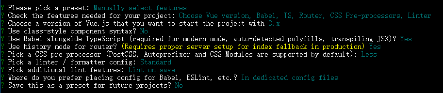

# Vue 3 从入门到实战

> 该文档假设你对 JavaScript、ES6 和 Vue 2 已具备一定基础。


## Vue 3 项目创建

### 1. 安装 Vue CLI 

使用 Vue CLI 创建 Vue 3 项目，需要 Vue CLI 的版本不低于 4.5，运行以下命令检查 Vue CLI 版本：

```sh
vue --version
@vue/cli 4.5.13
```

安装 Vue CLI：

```sh
npm install -g @vue/cli
```


### 2. 创建 vue 3 项目

在项目目录下运行命令：

```sh
vue create vue3-project
```

预设选择手动选择：


空格键勾选/取消选项，参考以下配置，创建项目：


### 3. 运行项目

进入创建的项目所在的目录，运行以下命令启动项目：

```sh
npm run build
```


## createApp

Vue 3 通过 `createApp` 创建 Vue 应用实例：

```js
// Vue 2
import Vue from 'vue'
import App from './App.vue'

new Vue({
  render: h => h(App)
}).$mount('#app')

// Vue 3
import { createApp } from 'vue'
import App from './App.vue'

createApp(App).mount('#app')
```

`createApp` 方法的第一个参数接收根组件，这个方法返回实例本身，因此可以在后面链式调用其他方法。


### 全局 API

Vue 2 的一些全局 API ，例如 `Vue.mixins` 和 `Vue.direative` 等，会影响所有实例，从而造成污染。在 Vue 3 中，这些 API 挂载在实例上，不会对所有实例造成污染。

```js
// Vue 2
// 这会影响到所有根实例
Vue.mixin({
  // ...
})
const app1 = new Vue({ el: '#app-1' })
const app2 = new Vue({ el: '#app-2' })

// Vue 3
const app = createApp({})
// 只对当前实例生效
app.mixin({
  // ...
})
app.mount('#app')
```


## 组合式 API

### 1. 什么是组合式 API

Vue 2 中，组件的代码通过 `data`、`computed`、`watch` 和 `methods` 等组件选项来组织逻辑。这种结构有一个潜在的问题，当组件的内容变得庞大时，这种分散的逻辑关注点就会导致代码难以理解和维护。

看一下 Vue 2 的一个组件实例：

```js
export default {
  data() {
    return {
      users: [],
      books: []
    }
  },
  computed: {
    filteredUsers() {
      // ...
    },
    FilterBooks() {
      // ...
    }
  },
  watch: {
    users(newValue, oldValue) {
      // ...
    },
    books(newValue, oldValue) {
      // ...
    }
  },
  methods: {
    getUsers() {
      // ...
    },
    getBooks() {
      // ...
    }
  }
}
```

组件中使用 `data`、`computed`、`watch` 和 `methods` 这些组件选项，每个选项都涉及 `users` 和 `books` 这两个数据，也就是说这两个数据的逻辑分散在不同的选项中，想象一下，当我们的数据比较多，或者每个函数的内容有很多行代码时，我们处理某一个数据，比如上面例子中的 `users`，就需要在几个选项之间来回切换，组件的维护就会变得比较困难。

看一下 Vue 3 组合式 API 的实例，后面会详解每个 API 的用法：

```js
import { reactive, computed, watch } from 'vue'

export default {
  setup() {
    // users 相关
    const users = reactive([])
    const filteredUsers = computed(() => {
      // ...
    })
    watch(users, (newValue, oldValue) => {
      // ...
    })
    const getUsers = () => {
      // ...
    }

    // books 相关
    const books = reactive([])
    const FilterBooks = computed(() => {
      // ...
    })
    watch(books, (newValue, oldValue) => {
      // ...
    })
    const getBooks = () => {
      // ...
    }

    return {
      users,
      filteredUsers,
      getUsers,
      books,
      FilterBooks,
      getBooks
    }
  }
}
```

可以看到，`users` 和 `books` 的相关业务被分别集中管理，**这也是组合式 API 的作用，使逻辑关注点更加集中，便于维护。** 引用一张社区的动图，能更直观地看到业务逻辑的变化：


除此之外，**我们还可以对某一部分业务进行封装，以便其他组件复用**。


### 2. setup 函数

`setup` 函数是组合式 API 的入口，在组件创建之前解析和执行。

> 因为 `setup` 是在组件创建之前执行，所以 `setup` 函数中的 `this` 并不是组件实例的引用，所以应当避免在 `setup` 中使用 `this`。

`setup` 函数接受两个参数，一个是 props，一个是 context。


#### props

```js
export default {
  props: {
    title: String
  },
  setup(props) {
    console.log(props.title)
  }
}
```

> `setup` 函数中 `props` 参数是响应式的，应该避免使用 ES6 解构，它会消除 `prop` 的响应性。如果需要解构 `prop`，可以在 `setup` 函数中使用 `toRefs` 函数来完成此操作。

```js
import { toRefs } from 'vue'

export default {
  setup(props) {
    const { title } = toRefs(props)
    console.log(title.value)
  }
}
```


#### context

`context` 是一个普通的 JavaScript 对象，可以被 ES6 安全解构，它暴露了一些其他可用的值。

```js
export default {
  setup(props, context) {
    // Attribute (非响应式对象，等同于 $attrs)
    console.log(context.attrs)

    // 插槽 (非响应式对象，等同于 $slots)
    console.log(context.slots)

    // 触发事件 (方法，等同于 $emit)
    console.log(context.emit)

    // 暴露公共 property (函数)
    console.log(context.expose)
  }
}
```


### 3. 响应式数据

#### ref 和 reactive 创建响应式数据

在 `setup` 函数中，如果要让某个变量变成响应式，则需要通过 `reactive` 或 `ref` 创建并返回变量。

- `ref` 用于对基本值（例如，字符串）创建独立响应式值，**如果要访问或修改变量的值，则需要通过 `.value`**；
- `reactive` 用于对一个对象创建响应式状态。

```vue
<template>
  <p>{{ count }}</p>
  <p>{{ person.name }}</p>
  <p>{{ person.age }}</p>
</template>

<script>
import { ref, reactive } from 'vue'

export default {
  setup() {
    const count = ref(1)
    console.log(count.value) // 需要通过 .value 访问变量
    
    const person = reactive({
      name: 'Tom',
      age: 20
    })
    

    return {
      count,
      person
    }
  }
}
</script>
```

> Vue 3 支持片段（fragment），即组件支持多根节点，减少了节点的嵌套。Vue 2 中多根节点会报错，为了避免这个问题往往多嵌套一层 `<div>`，增加了页面层级从而增加了开销。


#### toRefs 解构响应式对象

如果对 `reactive` 创建的响应式对象使用 ES6 解构语法，会使对象失去响应性，解决办法是使用 `toRefs`，可以在解构对象时保留对象属性的响应性，解构出来的属性相当于通过 `ref` 创建的响应式数据，在 `setup` 函数中需要通过 `.value` 访问：

```js
import { reactive, toRefs } from 'vue'

export default {
  setup() {
    const obj = reactive({
      count: 0
    })

    // const { count } = obj // 失去响应性
    const { count } = toRefs(obj) // 保留对象属性的响应性
    count.value++

    return {
      count
    }
  }
}
```


### 4. 方法

在 Vue 3 中，可以在 `setup` 中创建和返回独立的方法：

```vue
<template>
  <p>count: {{ count }}</p>
  <button @click="onIncrease">+</button>
</template>

<script>
import { ref } from 'vue'

export default {
  setup() {
    const count = ref(1)
    const onIncrease = () => {
      count.value++
    }

    return {
      count,
      onIncrease
    }
  }
}
</script>
```


### 5. 生命周期钩子

在 Vue 3 中，可以在 `setup` 中访问生命周期钩子，函数名为生命周期前面加 `on`：

| 选项 API        | setup 内生命周期钩子   |
| :------------ | --------------- |
| beforeCreate  | -               |
| created       | -               |
| beforeMount   | onBeforeMount   |
| mounted       | onMounted       |
| beforeUpdate  | onBeforeUpdate  |
| updated       | onUpdated       |
| beforeUnmount | onBeforeUnmount |
| unmounted     | onUnmounted     |

更多生命周期钩子参考：[生命周期钩子](https://v3.cn.vuejs.org/api/options-lifecycle-hooks.html#beforecreate)

这些函数接受一个回调函数，当钩子被组件调用时将会被执行：

```js
import { onMounted } from 'vue'

export default {
  setup() {
    onMounted(() => {
      console.log('onMounted')
    })
  }
}
```

> 因为 `setup` 是围绕 `beforeCreate` 和 `created` 生命周期钩子运行的，所以不需要显式地定义它们。换句话说，在这些钩子中编写的任何代码都应该直接在 `setup` 函数中编写。

### 6. computed

在 Vue 3 中，我们可以在 `setup` 中使用独立的 `computed` 函数来创建计算属性，`computed` 函数接受一个回调函数，返回一个只读的响应式引用，与 `ref` 类似，**我们需要通过 `.value` 访问计算属性的值**：

```vue
<template>
  <p>count: {{ count }}</p>
  <p>doubleCount: {{ doubleCount }}</p>
  <button @click="onIncrease">+</button>
</template>

<script>
import { ref, computed } from 'vue'

export default {
  setup() {
    const count = ref(1)
    const doubleCount = computed(() => count.value * 2)
    const onIncrease = () => {
      count.value++
    }
    
    return {
      count,
      doubleCount,
      onIncrease
    }
  }
}
</script>
```


### 7. watch

在 Vue 3 中，在 `setup` 中使用 `watch` 也需要引入，`watch` 函数接受3个参数：

- 一个想要侦听的 getter 函数（侦听响应式对象的一个属性）或者 `ref`
- 一个回调函数，第一个参数表示变化后的值，第二个参数表示旧值
- 可选的配置选项，例如：`{ immediate: false, deep: false }`

```js
// 直接侦听一个 ref
const count = ref(0)
watch(count, (count, prevCount) => {
  /* ... */
})

// 侦听响应式对象的一个属性
const state = reactive({ count: 0 })
watch(
  () => state.count,
  (count, prevCount) => {
    /* ... */
  }
)
```


####侦听多个数据源

`watch` 还可以使用数组同时侦听多个源，第一个参数是监听数据的数组，第二参数仍然是回调函数，只不过回调函数的两个参数都是数组：

```js
const firstName = ref('')
const lastName = ref('')

watch([firstName, lastName], (newValues, prevValues) => {
  console.log(newValues, prevValues)
})

firstName.value = 'John' // logs: ["John", ""] ["", ""]
lastName.value = 'Smith' // logs: ["John", "Smith"] ["John", ""]
```

除此之外，也可以定义多个 `watch`，将不同值的侦听逻辑分开：

```js
watch(firstName, (firstName, prevFirstName) => {
  console.log(firstName, prevFirstName)
})
watch(lastName, (lastName, prevLastName) => {
  console.log(lastName, prevLastName)
})
```


#### 侦听响应式对象

侦听一个响应式对象或数组将始终返回该对象的当前值和上一个状态值的引用。对于一维数组或者没有多层嵌套的对象，可以通过 `...` 扩展运算符返回数组或者对象的副本，如果是多维数组或者多层嵌套的对象，则需要对值进行深拷贝，这可以通过诸如 [lodash.cloneDeep](https://lodash.com/docs/4.17.15#cloneDeep) 这样的实用工具来实现。

```js
import { reactive, watch } from 'vue'
import { cloneDeep } from 'lodash'

export default {
  setup() {
    const list = reactive([1, 2, 3])
    // 一维数组，使用扩展运算符拷贝数组
    watch(() => [...list], (list, prevList) => {
      console.log(list, prevList)
    })
    list.push(4)
    
    const user = reactive({
      name: {
        firstName: 'Emily',
        lastName: 'Tom'
      },
      age: 20
    })
    // 多层嵌套的对象，需要深拷贝
    watch(() => cloneDeep(user), (user, prevUser) => {
      console.log(user, prevUser)
    })
    user.name.firstName = 'Victoria'
  }
}
```


### 8. provide/inject

当组件层级较多时，通过逐级 `props` 传递数据是比较麻烦和难以维护的，这种情况可以使用 `provide/inject` 来传递数据。祖先组件通过 `provide` 提供数据，后代组件通过 `inject` 使用这些数据。

在 `setup` 中使用 `provide/inject` 也需要显式导入。

`provide` 函数参数：

1. 属性名（`String`）
2. 属性值

`inject` 函数参数：

1. 需要 inject 的属性名
2. 默认值（可选）

```vue
<!-- ParentComponent.vue -->
<template>
  <child-component></child-component>
</template>

<script>
import { provide } from 'vue'
import ChildComponent from './ChildComponent.vue'

export default {
  components: {
    ChildComponent
  },
  setup() {
    provide('user', {
      name: 'Tom',
      age: 20
    })
  }
}
</script>
```

```vue
<!-- ChildComponent.vue -->
<template>
  <p>name: {{ user.name }}</p>
  <p>age: {{ user.age }}</p>
</template>

<script>
import { inject } from 'vue'

export default {
  setup() {
    const user = inject('user')

    return {
      user
    }
  }
}
</script>
```


#### 添加响应式

为了增加 `provide` 值和 `inject` 值之间的响应性，我们可以在 `provide` 值时使用 `ref` 或 `reactive`。

```vue
<!-- ParentComponent.vue -->
<template>
  <child-component></child-component>
</template>

<script>
import { provide, reactive } from 'vue'
import ChildComponent from './ChildComponent.vue'

export default {
  components: {
    ChildComponent
  },
  setup() {
    const user = reactive({
      name: 'Tom',
      age: 20
    })
    provide('user', user)
    user.name = 'Jacket' // 修改 provide 值，后代组件同步修改
  }
}
</script>
```


#### 修改响应式属性

为了方便维护，建议将对响应式属性的所有修改限制在定义 `provide` 的组件内部。如果需要在注入数据的组件内部更新 `inject` 的数据，建议 `provide` 一个方法来负责改变响应式属性。除此之外，对 `provide` 的属性使用 `readonly`，可以确保数据不会被 `inject` 组件直接修改。

```vue
<!-- ParentComponent.vue -->
<template>
  <child-component></child-component>
</template>

<script>
import { provide, reactive, readonly } from 'vue'
import ChildComponent from './ChildComponent.vue'

export default {
  components: {
    ChildComponent
  },
  setup() {
    const user = reactive({
      name: 'Tom',
      age: 20
    })
    const setUserName = name => {
      user.name = name
    }
    provide('user', readonly(user))
    provide('setUserName', setUserName)
  }
}
</script>
```

在复杂的场景中，多个组件之间相互影响状态，基于 `props` 或者 `provide/inject` 的单向数据流就会显示捉襟见肘，而且维护起来也比较麻烦，这种场景建议使用 `Vuex` 进行集中式状态管理。


### 9. 实战：购物车


实现一个购物车的功能：

1. 显示购物车商品列表，包含商品名称和价格等基本信息；
2. 可以改变商品的数量或者移除；
3. 根据商品价格和数量显示总价；
4. 支持勾选/全选/取消全选等操作。

涉及技术点：Vue 列表渲染、事件处理、计算属性、表单输入绑定等。

首先，假定购物车的原始数据，并通过 `reactive` 返回响应式数据 ：

```js
import { reactive } from 'vue'

export default {
  setup() {
    const list = reactive([
      {
        id: 1,
        name: '黑色签字笔',
        price: 2.6,
        count: 1,
        checked: true
      },
      {
        id: 2,
        name: '办公笔记本',
        price: 5,
        count: 1,
        checked: true
      },
      {
        id: 3,
        name: '旋转笔筒',
        price: 15.8,
        count: 1,
        checked: true
      }
    ])

    return {
      list
    }
  }
}
```

创建 DOM 结构：

```vue
<template>
  <table>
    <thead>
      <tr>
        <th><input type="checkbox" />全选</th>
        <th>商品</th>
        <th>价格</th>
        <th>数量</th>
        <th>操作</th>
      </tr>
    </thead>
    <tbody>
      <tr v-for="item in list" :key="item.id">
        <td>
          <input type="checkbox" />
        </td>
        <td>{{ item.name }}</td>
        <td>￥{{ item.price }}</td>
        <td>
          <button>-</button>
          {{ item.count }}
          <button>+</button>
        </td>
        <td><button>删除</button></td>
      </tr>
    </tbody>
  </table>
</template>
```

```css
table {
  border-collapse: collapse;
  border: 1px solid #ddd;
}
table thead {
  background-color: #ccc;
}
table thead th {
  padding: 16px;
}
table tbody td {
  padding: 16px;
}
```

计算属性获取总价：

```diff
  <template>
    <table>
      <!-- ... -->
    </table>
+   <p>总价：￥{{ totalPrice }}</p>
  </template>
```

```diff
- import { reactive } from 'vue'
+ import { reactive, computed } from 'vue'

  export default {
    setup() {
      const list = reactive([
        // ...
      ])
+     // 计算总价
+     const totalPrice = computed(() => {
+       let totalPrice = list.reduce((total, item) => {
+         if (item.checked) {
+           total += item.price * item.count
+         }
+         return total
+       }, 0)
+       // 最多保留两位小数
+       totalPrice = Math.round(totalPrice * 100) / 100
+       return totalPrice
+     })

      return {
        list,
+       totalPrice
      }
    }
  }
```

为按钮添加事件：

```diff
  <template>
    <table>
      <thead>
        <tr>
          <th><input type="checkbox" />全选</th>
          <th>商品</th>
          <th>价格</th>
          <th>数量</th>
          <th>操作</th>
        </tr>
      </thead>
      <tbody>
-     	<tr v-for="item in list" :key="item.id">
+       <tr v-for="(item, index) in list" :key="item.id">
          <td>
            <input type="checkbox" />
          </td>
          <td>{{ item.name }}</td>
          <td>￥{{ item.price }}</td>
          <td>
-         	<button>-</button>
+           <button :disabled="item.count === 0" @click="onReduce(index)">-</button>
            {{ item.count }}
-           <button>+</button>
+           <button @click="onAdd(index)">+</button>
          </td>
-         <td><button>删除</button></td>
+         <td><button @click="onRemove(index)">删除</button></td>
        </tr>
      </tbody>
    </table>
    <p>总价：￥{{ totalPrice }}</p>
  </template>
```

```diff
  import { reactive, computed } from 'vue'

  export default {
    setup() {
      const list = reactive([
		// ...
      ])
      // 计算总价
      const totalPrice = computed(() => {
        // ...
      })
+     const onReduce = index => {
+       list[index].count--
+     }
+     const onAdd = index => {
+       list[index].count++
+     }
+     const onRemove = index => {
+       list.splice(index, 1)
+     }

      return {
        list,
        totalPrice,
+       onReduce,
+       onAdd,
+       onRemove
      }
    }
  }
```

处理购物车清空的情况：

```diff
  <template>
+   <template v-if="list.length">
      <table>
		<!-- ... -->
      </table>
      <p>总价：￥{{ totalPrice }}</p>
+   </template>
+   <template v-else>购物车为空</template>
  </template>
```

添加选择框勾选事件：

```diff
- import { reactive, computed } from 'vue'
+ import { reactive, ref, computed } from 'vue'

  export default {
    setup() {
      // ...

+     // 是否全选
+     const checkAll = ref(false)
+     // 勾选和全选联动
+     const onCheck = () => {
+       if (list.every(item => item.checked)) {
+         checkAll.value = true
+       } else {
+         checkAll.value = false
+       }
+     }
+     // 全选/取消全选
+     const onCheckAll = () => {
+       checkAll.value = !checkAll.value
+       list.forEach(item => {
+         item.checked = checkAll.value
+       })
+     }
+     // 初始化检查是否全选
+     onCheck()

      return {
        // ...
+       checkAll,
+       onCheck,
+       onCheckAll
      }
    }
  }
```


## 组件自定义事件（emits）

Vue 3 新增 `emits` 选项，用于自定义事件，官方建议定义所有触发的事件，以便更好地记录组件应该如何工作。

`emits` 支持数组和对象，使用对象语法可以对事件参数进行验证，如果验证不通过，控制台会发出警告。

```js
// 子组件

export default {
  // 数组
  emits: ['open'],
  // 对象
  // emits: {
  //   open(value) {
  //     return typeof value === 'boolean'
  //   }
  // },
  setup(props, { emit }) {
    emit('open', true)
  }
}
```

```js
// 父组件

export default {
  setup() {
    const onOpen = value => {
      console.log('onOpen', value)
    }

    return {
      onOpen
    }
  }
}
```

```vue
<template>
  <child-component @open="onOpen"></child-component>
</template>
```


## 组件自定义 v-model

Vue 3 中自定义组件 `v-model` 的变化：

| Vue 2                        | Vue 3                                    |
| ---------------------------- | ---------------------------------------- |
| 默认 prop：`value`，默认事件：`input` | 默认 prop：`modelValue`，默认事件：`update:modelValue` |
| `model` 选项更改 prop 和事件名称      | `v-model` 指定参数                           |
| `.sync` 修饰符对 prop 进行“双向绑定”   | `v-model` 指定参数（支持多个）                     |
| -                            | 支持自定义 `v-model` 修饰符                      |


### 默认 prop 和事件名称

```vue
<!-- Vue 2 -->
<child-component v-model="pageTitle" />

<!-- 是以下的简写: -->

<child-component :value="pageTitle" @input="pageTitle = $event" />
```

```vue
<!-- Vue 3 -->
<child-component v-model="pageTitle" />

<!-- 是以下的简写: -->

<child-component
  :modelValue="pageTitle"
  @update:modelValue="pageTitle = $event"
/>
```


### 修改 prop 和事件名称

```vue
<!-- Vue 2 -->

<!-- ChildComponent.vue -->
<script>
export default {
  // model 选项指定 prop 和事件名称
  model: {
    prop: 'title',
    event: 'change'
  },
  props: {
    title: String
  }
}
</script>

<!-- ParentComponent.vue -->
<child-component v-model="pageTitle" />

<!-- 是以下的简写（变更了绑定的属性和事件名称）: -->

<child-component :title="pageTitle" @change="pageTitle = $event" />
```

```vue
<!-- Vue 3 -->

<!-- ParentComponent.vue -->
<child-component v-model="pageTitle" />

<!-- 是以下的简写（变更了绑定的属性和事件名称，不需要修改 model 选项）: -->

<child-component :title="pageTitle" @update:title="pageTitle = $event" />
```


### 替代 .sync 修饰符

Vue 2：

```js
// ChildComponent.vue
// 属性变化时触发事件
this.$emit('update:title', newValue)
```

```vue
<!-- ParentComponent.vue -->
<child-component :title="pageTitle" @update:title="pageTitle = $event" />

<!-- 使用 .sync 修饰符简写： -->

<child-component :title.sync="pageTitle" />
```

Vue 3：

```vue
<child-component
  :title="pageTitle"
  @update:title="pageTitle = $event"
/>

<!-- 可简写为： -->

<child-component v-model:title="pageTitle" />
```


## setup 语法糖

`<script setup>` 是在单文件组件 (SFC) 中使用组合式 API 的编译时语法糖。相比于普通的 `<script>` 语法，它具有更多优势：

- 更少的样板内容，更简洁的代码。
- 能够使用纯 Typescript 声明 `props` 和抛出事件。
- 更好的运行时性能 (其模板会被编译成与其同一作用域的渲染函数，没有任何的中间代理)。
- 更好的 IDE 类型推断性能 (减少语言服务器从代码中抽离类型的工作)。


### ESLint 支持

ESLint 对 `setup` 语法糖的支持并不友好，需要将 `no-unused-vars` 规则关闭：

```diff
// .eslintrc.js
module.exports = {
  rules: {
    'no-console': process.env.NODE_ENV === 'production' ? 'warn' : 'off',
    'no-debugger': process.env.NODE_ENV === 'production' ? 'warn' : 'off',
    'space-before-function-paren': ['error', 'never'],
+   'no-unused-vars': 'off'
  }
}
```


### 数据和方法

`<script setup>` 中定义的数据和方法，包含 `import` 导入的变量，都能在模板中直接使用：

```vue
<template>
  <div>{{ sum(1, 2) }}</div>
  <div>{{ count }}</div>
  <div>{{ refCount }}</div>
  <button @click="onIncrease">+</button>
</template>

<script setup>
import { ref } from 'vue'
import { sum } from '@/utils/sum'

const count = 0
const refCount = ref(0)
const onIncrease = () => {
  refCount.value++
}
</script>
```


### 使用组件

`<script setup>` 范围里的值也能被直接作为自定义组件的标签名使用：

```vue
<template>
  <child-component></child-component>
</template>

<script setup>
import ChildComponent from './ChildComponent.vue'
</script>

<style scoped>

</style>
```


### defineProps 和 defineEmits

在 `<script setup>` 中必须使用 `defineProps` 和 `defineEmits` API 来声明 `props` 和 `emits` ，它们具备完整的类型推断并且在 `<script setup>` 中是直接可用的：

```vue
<!-- ChildComponent.vue -->
<template>
  <div>title：{{ title }}</div>
  <div>count: {{ count }}</div>
  <button @click="onChange">emit</button>
</template>

<script setup>
const props = defineProps({
  title: String,
  count: {
    type: Number,
    required: true
  }
})

const emit = defineEmits(['change'])

const onChange = () => {
  emit('change', 123)
}
</script>
```

```vue
<!-- ParentComponent.vue -->
<template>
  <child-component
    title="标题"
    :count="1"
    @change="onChange">
  </child-component>
</template>

<script setup>
import ChildComponent from './ChildComponent.vue'

const onChange = value => {
  console.log('接收子组件数据', value)
}
</script>
```

- `defineProps` 接收一个 `props` 对象作为参数，和组件的 `props` 选项保持一致。
- `defineEmits` 接收一个 `emits` 数组作为参数，和组件的 `emits` 选项保持一致，返回值用法和 `setup` 函数的第二个参数解构出来的 `emit` 一致。

`defineProps` 和 `defineEmits` 都只在 `<script setup>` 中才能使用的**编译器宏**，不需要导入且会随着 `<script setup>` 处理过程一同被编译掉。使用 ESlint 时，需要将这两个变量在 `globals` 中进行声明：

```js
// .eslintrc.js
module.exports = {
  globals: {
    defineProps: 'readonly',
    defineEmits: 'readonly'
  }
}
```


#### TypeScript 中使用

在 TypeScript 中，可以为 `defineProps` 和 `defineEmits` 使用类型声明，代替参数传递，注意这两种方式不能同时使用，否则编译会出错。修改上面的例子：

```diff
  <!-- ChildComponent.vue -->
  <template>
    <div>title：{{ title }}</div>
    <div>count: {{ count }}</div>
    <button @click="onChange">emit</button>
  </template>

- <script setup>
+ <script setup lang="ts">
- const props = defineProps({
-   title: String,
-   count: {
-     type: Number,
-     required: true
-   }
- })
+ type Props = {
+   title?: string,
+   count: number
+ }
+ const props = defineProps<Props>()

- const emit = defineEmits(['change'])
+ type Emits = {
+   (event: 'change', value: number): void
+ }
+ const emit = defineEmits<Emits>()

  const onChange = () => {
    emit('change', 123)
  }
  </script>
```

```diff
  <!-- ParentComponent.vue -->
  <template>
    <child-component
      title="标题"
      :count="1"
      @change="onChange">
    </child-component>
  </template>

  <script setup>
  import ChildComponent from './ChildComponent.vue'

- const onChange = value => {
+ const onChange = (value: number) => {
    console.log('接收子组件数据', value)
  }
  </script>
```

仅限类型的 `defineProps` 声明的不足之处在于，它没有可以给 props 提供默认值的方式。为了解决这个问题，官方提供了 `withDefaults` 编译器宏：

```diff
  type Props = {
    title?: string,
    count: number
  }
- const props = defineProps<Props>()
+ const props = withDefaults(defineProps<Props>(), {
+   title: '',
+   count: 0
+ })
```

> 若项目中用到 ESLint，同样需要在配置文件中的 `globals` 属性中声明 `withDefaults` 。


### 通过另一个 `<script>` 指定组件选项

如果需要为当前组件指定某些选项，例如组件名称，则需要定义另外一个 `<script>` 并导出：

```vue
<template>
  <child-component></child-component>
</template>

<script setup>
import ChildComponent from './ChildComponent.vue'
</script>

<script>
export default {
  name: 'ParentComponent'
}
</script>

<style scoped>

</style>
```

> 一个 SFC 只能有一个 `<script>` 标签带 `setup` 属性。


## Vue Router

Vue Router 也随着 Vue 3 版本的更新重写了 API，Vue Router 的 Vue 3 版本基于 Vue Router4。


### 1. 创建路由

Vue Router4 中，不再使用 `new Router` 创建路由实例，而是通过 `createRouter` 方法：

```js
// Vue 2
import Router from 'vue-router'

const router = new Router({
  // ...
})

// Vue 3
import { createRouter } from 'vue-router'

const router = createRouter({
  // ...
})
```

挂载 Vue 实例：

```diff
  // Vue 2
  import Vue from 'vue'
  import App from './App.vue'
+ import router from './router'

  new Vue({
+   router,
    render: h => h(App)
  }).$mount('#app')

  // Vue 3
  import { createApp } from 'vue'
  import App from './App.vue'
+ import router from './router'

- createApp(App).mount('#app')
+ createApp(App).use(router).mount('#app')

```


### 2. 路由模式

Vue Router4 不再使用 `mode` 定义路由模式，而是定义对应的模式选项，并通过对应的函数创建模式：

```js
// Vue 2
const router = new Router({
  mode: 'hash' // 'hash' | 'history' | 'abstract'
})


// Vue 3
import { createRouter, createWebHistory, createWebHashHistory, createMemoryHistory } from 'vue-router'

const router = createRouter({
  history: createWebHistory()
  // hash: createWebHashHistory()
  // abstract: createMemoryHistory()
})

```


### 3. 移动了 base 参数

旧版本的 Vue Router，通过 `base` 选项配置基础路径，Vue Router4 将 `base` 作为 `createWebHistory` (其他 history 也一样) 函数的第一个参数传递：

```js
// Vue 2
const router = new VueRouter({
  mode: 'history',
  base: process.env.BASE_URL
})

// Vue 3
const router = createRouter({
  history: createWebHistory(process.env.BASE_URL)
})
```


### 4. 组件中使用

Vue 2 的组件中，通过 `this.$router` 和 `this.$route` 分别获取路由实例和当前路由；Vue 3 中，由于 `setup` 函数中不能通过 `this` 访问组件实例，所以需要通过 `useRouter` 和 `useRoute` 来访问路由对象：

```js
// Vue 2
this.$router.push('/home')
const id = this.$route.params.id

// Vue 3
import { useRouter, useRoute } from 'vue'
export default {
  const router = useRouter()
  const route = useRoute()
  
  router.push('/home')
  const id = route.params.id
}
```


### 5. 删除了 * 通配符匹配

Vue Router4 取消了路由的正则匹配，如果需要匹配未找到的路由，则需要通过 `pathMatch` 参数:

```js
const routes = [
  // ...
  {
    path: '/:pathMatch(.*)*', // Vue-Router4 取消了 *、/* 等正则匹配
    redirect: '/404'
  }
]

const router = createRouter({
  history: createWebHistory(process.env.BASE_URL),
  routes
})
```


## Vuex（不推荐）

Vuex 也随着 Vue 3 版本的更新重写了 API，Vuex 的 Vue 3 版本基于 Vuex 4。


### 1. 创建

Vuex 4 中，不再使用 `new Vuex` 创建路由实例，而是通过 `createStore` 方法：

```js
// vue 2
import Vuex from 'vuex'

const store = new Vuex.Store({
  // ...
})

// vue 3
import { createStore } from 'vuex'

const store = createStore({
  // ...
})
```

挂载 Vue 实例：

```diff
  // Vue 2
  import Vue from 'vue'
  import App from './App.vue'
+ import store from './store'

  new Vue({
+   store,
    render: h => h(App)
  }).$mount('#app')

  // Vue 3
  import { createApp } from 'vue'
  import App from './App.vue'
+ import store from './store'

- createApp(App).mount('#app')
+ createApp(App).use(store).mount('#app')
```


### 2. 组件中使用

Vue 3 中，由于 `setup` 函数中不能通过 `this` 访问组件实例，所以需要通过 `useStore` 来访问仓库：

```js
// src/store/index.js

import { createStore } from 'vuex'

export default createStore({
  state: {
    counter: 0
  },
  mutations: {
    INCREASE(state, n) {
      state.counter += n
    }
  },
  actions: {
    Increase({ commit }, n) {
      commit('INCREASE', n)
    }
  }
})
```

```js
import { useStore } from 'vuex'
import { computed } from 'vue'

export default {
  setup() {
    const store = useStore()
    
    const counter = computed(() => store.state.counter)

    const onIncrease = n => {
      store.dispatch('Increase', n)
    }

    return {
      counter,
      onIncrease
    }
  }
}
```


## Pinia（推荐）

[Pinia](https://pinia.vuejs.org/introduction.html) 是 Vue 官方团队开发的 Vue 状态管理的解决方案，Pinia 实现了 Vuex 5 的许多提案，是下一代的 Vuex。

Pinia 相比于 Vuex 3/4，具有以下特点：

- 去除了 `mutations` ，不再需要通过 `mutations` 这种冗长的方式修改状态。
- 更好地 TypeScript 支持。
- 无需手动添加 store，store 创建后会自动添加。
- 扁平化设计，无嵌套模块，也不需要命名空间，store 之间可以交叉组合使用。 


### 1. 安装

```sh
npm install pinia
```

> Pinia 可以在 Vue 2 和 Vue 3 中使用，在 Vue 2 中使用需要安装和使用组合式 API：`@vue/composition-api`


### 2. 创建和挂载实例

```js
// src/main.js
import { createApp } from 'vue'
import App from './App.vue'
import { createPinia } from 'pinia'

const app = createApp(App)
app.use(createPinia()).mount('#app')
```


### 3. 创建 store

```js
// src/store/index.js

import { defineStore } from 'pinia'

export const useCounterStore = defineStore('counter', {

})
```

`defineStore` 函数第一个参数表示 store 的名称，这个值需要唯一。


#### state

和 Vuex 一样，`state` 表示要管理的数据：

```js
import { defineStore } from 'pinia'

export const useCounterStore = defineStore('counter', {
  state: () => {
    return {
      counter: 0
    }
  }
})
```

`state` 和 Vue 2 组件中 `data` 选项的声明差不多，一个函数，返回一个对象，对象的属性就是响应式的数据。值得注意的是，`state` 采用箭头函数，这是为了保证服务端渲染也能正常使用。

在组件中使用：

```vue
<template>
  <div>{{ counterStore.counter }}</div>
</template>
```

```js
import { useCounterStore } from '@/store/user'

export default {
  setup() {
    const counterStore = useCounterStore()
    counterStore.counter++

    return {
      counterStore
    }
  }
}
```

状态值可以直接修改，但是建议通过 `actions` 对状态值进行统一修改，避免数据混乱，难以维护。

和 Vue 3 中对响应式对象解构类似，对 `store` 使用解构语法，也会使状态值失去响应性，解决办法是引入 `storeToRefs` 方法：

```vue
<template>
  <div>{{ counter }}</div>
</template>
```

```js
import { useCounterStore } from '@/store/user'
import { storeToRefs } from 'pinia'

export default {
  setup() {
    const counterStore = useCounterStore()
    const { counter } = storeToRefs(counterStore)

    return {
      counter
    }
  }
}
```


#### getters

```diff
  import { defineStore } from 'pinia'

  export const useCounterStore = defineStore('counter', {
    state: () => {
      return {
-     	counter: 0
+       counter: 10
      }
    },
+   getters: {
+     doubleCount(state) {
+       return state.counter * 2
+     },
+     plusOne() {
+       return this.counter + 1
+     }
+   }
  })
```

`getters` 相当于 store 中 `state` 的计算属性，声明一个函数，第一个参数是 `state`，函数返回属性值。和 Vue 2 实例类似，store 中 `this` 指代 store 实例，因此可以通过 `this` 访问属性和方法。

```vue
<template>
  <div>{{ counter }}</div>
  <div>{{ doubleCount }}</div>
  <div>{{ plusOne }}</div>
</template>
```

```js
import { useCounterStore } from '@/store/user'
import { storeToRefs } from 'pinia'

export default {
  setup() {
    const counterStore = useCounterStore()
    const { counter, doubleCount, plusOne } = storeToRefs(counterStore)

    return {
      counter,
      doubleCount,
      plusOne
    }
  }
}
```


#### actions

`actions` 声明方式和 Vue 2 中的 `methods` 类似，而且也可以通过 `this` 访问属性：

```diff
  import { defineStore } from 'pinia'

  export const useCounterStore = defineStore('counter', {
    state: () => {
      return {
        counter: 10
      }
    },
+   actions: {
+     increase(n) {
+       this.counter += n
+     }
+   }
  })
```

```vue
<template>
  <div>{{ counter }}</div>
  <button @click="onIncreaseOne">+</button>
</template>
```

```js
import { useCounterStore } from '@/store/user'
import { storeToRefs } from 'pinia'

export default {
  setup() {
    const counterStore = useCounterStore()
    const { counter } = storeToRefs(counterStore)

    const onIncreaseOne = () => {
      counterStore.increase(1)
    }

    return {
      counter,
      onIncreaseOne
    }
  }
}
```


## 实战：移动端头条页面

实战内容：实现一个移动端头条页面，包含底部导航和两个主要页面：头条和今日一笑

组件库：[Vant 3]([介绍 - Vant 3 (youzan.github.io)](https://youzan.github.io/vant/#/zh-CN/home))

API：[京东万象API](https://wx.jdcloud.com/api)（部分免费，每天限1000次）


### 

### 1. 定义路由

首先，定义页面的基本路由：

```js
// src/router/index.js

import { createRouter, createWebHistory } from 'vue-router'

export const routes = [
  {
    path: '/',
    redirect: '/news'
  },
  {
    // 新闻页
    path: '/news',
    name: 'News',
    component: () => import('@/views/news/Index.vue'),
    meta: { keepAlive: true, show: true, title: '头条', icon: 'wap-home-o' }
  },
  {
    // 新闻详情页
    path: '/news/detail',
    name: 'NewsDetail',
    component: () => import('@/views/news/Detail')
  },
  {
  	// 每日一笑
    path: '/joke',
    name: 'Joke',
    component: () => import('@/views/Joke.vue'),
  	meta: { keepAlive: true, show: true, title: '每日一笑', icon: 'smile-comment-o' }
  },
  {
  	// 404 页面
    path: '/404',
    name: 'Error404',
    component: () => import('@/views/Error404.vue')
  },
  {
    path: '/:pathMatch(.*)*',
    redirect: '/404'
  }
]

const router = createRouter({
  history: createWebHistory(process.env.BASE_URL),
  routes
})

export default router
```

`meta` 自定义路由数据：

- `meta.keepAlive` 表示是否缓存页面。我们离开某个页面，该页面的组件默认会被销毁，返回该页面需要重新加载组件和数据。新闻跳转详情页后再返回，我们不希望重新获取数据，所以需要结合 `keep-alive` 将组件缓存。
- `meta.show` 表示该页面是否显示底部导航栏。
- `meta.title` 表示页面底部导航标题。
- `meta.icon` 表示底部导航图标，参考 [Vant 3 Icon](https://youzan.github.io/vant/#/zh-CN/icon)。

路由追加了 404 页面，并在路由表最后将所有未匹配到的路由都重定向到 404 页面，这在页面开发中是必要的，可以对用户起引导作用。用户输错了网址，或者某个之前的页面已不再维护，如果打开后整个页面空白，这会让用户产生疑惑。


### 2. 引入 Vant 3 组件库

参考 [Vant 3 组件库文档](https://youzan.github.io/vant/#/zh-CN/quickstart)。

通过 `npm` 安装：

```sh
npm install vant
```

安装按需导入插件 `babel-plugin-import`：

```sh
npm install --save-dev babel-plugin-import
```

修改 `babel.config.js`：

```js
module.exports = {
  // ...
  plugins: [
    [
      'import',
      {
        libraryName: 'vant',
        libraryDirectory: 'es',
        style: true
      }
    ]
  ]
}
```

创建 `src/plugins/vant.js` 文件，用于定义全局引入组件：

```js
import {
  Button,
  List
} from 'vant'

const loadVant = app => {
  app.use(Button)
  app.use(List)
}

export default loadVant
```

引入组件：

```js
// src/main.js

import { createApp } from 'vue'
import App from './App.vue'
import router from './router'
import { createPinia } from 'pinia'
import loadVant from '@/plugins/vant'

const app = createApp(App)

loadVant(app) // 引入组件库

app.use(createPinia()).use(router).mount('#app')
```


### 3. 创建底部导航组件

```vue
<!-- src/components/BottomTabBar.vue -->
<template>
  <van-tabbar v-model="activeIndex"  @change="onChange">
    <van-tabbar-item
      v-for="route in tabbarList"
      :key="route.path"
      :icon="route.meta.icon">
      {{ route.meta.title }}
    </van-tabbar-item>
  </van-tabbar>
</template>
```

```js
import { ref, watch } from 'vue'
import { useRouter, useRoute } from 'vue-router'
import { routes } from '@/router'

export default {
  setup() {
    const activeIndex = ref(0)
    const router = useRouter()
    const route = useRoute()
    const tabbarList = routes.filter(route => route.meta?.show)

    // 点击切换
    const onChange = index => {
      activeIndex.value = index
      router.push(tabbarList[index].path)
    }
    // 根据路由高亮导航
    watch(() => route.path, newPath => {
      const index = tabbarList.findIndex(route => route.path === newPath)
      console.log(newPath, index)
      if (index >= 0) {
        activeIndex.value = index
      }
    }, { immediate: true })

    return {
      activeIndex,
      tabbarList,
      onChange
    }
  }
}
```

从路由表中筛选出 `meta.show = true` 的路由，作为底部导航栏渲染的列表。

高亮导航栏： `<van-tabbar>` 组件的 `@change` 方法可以监听底部导航的切换，以此来高亮底部导航栏，但是用户不一定从首页打开，这种方法没法在页面刚打开时高亮对应的导航栏，因此采用了 `watch` （`immdediate`）来监听路由的变化，从而高亮对应的导航。


### 4. 页面基本布局

```vue
<!-- src/App.vue -->

<template>
  <router-view />

  <bottom-tab-bar v-if="$route.meta?.show"></bottom-tab-bar>
</template>
```

页面由两部分组成，顶部的主体内容，通过路由进行切换，以及底部导航栏。部分页面，例如新闻详情页，我们不需要显示底部导航栏，因此通过路由的 `meta.show` 来控制是否在底部导航栏中显示。

之前我们在路由中定义了 `meta.keepAlive`，需要结合 Vue 内置组件 `<keep-alive>` 来缓存组件：

```vue
<template>
  <router-view v-slot="{ Component }">
    <keep-alive :include="cachedViewsName">
      <component :is="Component"></component>
    </keep-alive>
  </router-view>

  <bottom-tab-bar v-if="$route.meta?.show"></bottom-tab-bar>
</template>
```

> Vue 3 中，`<keep-alive>` 必须通过 `v-slot` API 在 `RouterView` 内部使用。

```js
import BottomTabBar from '@/components/BottomTabBar.vue'
import { reactive } from 'vue'
import { routes } from '@/router'

export default {
  components: {
    BottomTabBar
  },
  setup() {
    const cachedViewsName = reactive([])
    const viewsName = routes.filter(route => route.meta?.keepAlive).map(route => route.name)
    cachedViewsName.push(...viewsName)
                                        
    return {
      cachedViewsName
    }
  }
}
```

定义了 `cachedViewsName[]`， 筛选路由表中 `meta.keepAive = ture` 的路由对应的 `name`（路由名称需要和组件名称保持一致），作为 `<keep-alive>` 的 `include` 属性值。


### 5. 封装 axios 和 API

项目中使用到的新闻和每日一笑 API 来自 [京东万象API](https://wx.jdcloud.com/api)，需要注册账号并获取 `appkey`。

需要安装 axios，用于接口请求：

```sh
npm install axios
```

封装 axios：

```js
// api/utils/http.js

import axios from 'axios'
import { Notify } from 'vant'

const http = axios.create({
  baseURL: 'https://way.jd.com',
  timeout: 10000
})

// 请求拦截
http.interceptors.request.use(
  config => config,
  error => Promise.reject(error)
)

// 响应拦截
http.interceptors.response.use(
  response => {
    if (response.data.code === '10000') {
      return response.data.result
    }
    // 请求失败提示
    const { msg } = response.data
    Notify({ type: 'danger', message: msg })
    return Promise.reject(new Error(msg))
  },
  error => {
    // 请求失败提示
    Notify({ type: 'danger', message: '连接失败，请刷新重试' })
    return Promise.reject(error)
  }
)

// 封装 GET 请求
export const get = (url, params = {}, config = {}) => {
  return http({
    url,
    method: 'GET',
    params,
    ...config
  })
}

// 封装 POST 请求
// export const post = (url, data = {}, config = {}) => {
//   return http({
//     url,
//     method: 'POST',
//     data,
//     ...config
//   })
// }
```

封装接口：

```js
// src/api/index.js

import { get } from './utils/http'
import appkey from './utils/appKey'
import showApiSign from './utils/showApiSign'

// 获取新闻
export const getNews = (start, num = 10, channel = '头条') => {
  return get('/jisuapi/get', {
    start,
    num,
    channel,
    appkey // 你的 appkey
  })
}

// 获取笑话
export const getJokes = (time, page = 1, maxResult = 5) => {
  return get('/showapi/wbxh', {
    time,
    page,
    maxResult,
    showapi_sign: showApiSign,
    appkey
  })
}
```

浏览器不能直接访问 `https://way.jd.com` 域名下的接口，会有跨域的问题，因此需要为 `devServer` 设置 `Proxy`（实际开发中，第三方接口需要后端封装来避免跨域）：

```js
// vue.config.js

module.exports = {
  devServer: {
    proxy: {
      '/api': {
        target: 'https://way.jd.com',
        changeOrigin: true,
        pathRewrite: {
          '^/api': ''
        }
      }
    }
  }
}
```

将 `baseURL` 改为 `/api`：

```diff
// api/utils/http.js

  import axios from 'axios'

  const http = axios.create({
-   baseURL: 'https://way.jd.com',
+   baseURL: '/api'
    timeout: 10000
  })
```


### 6. 缓存页面滚动位置

对于部分缓存页面，我们希望离开页面时能保存页面滚动位置，例如新闻列表页；对于其他页面，我们希望打开后能滚动到顶部。

首先，创建一个工具函数 `saveScrollPosition`，用于组件内缓存滚动位置：

```js
// src/utils/saveScrollPosition
import { onActivated } from 'vue'
import { onBeforeRouteLeave } from 'vue-router'

const saveScrollPosition = () => {
  let top = 0
  onBeforeRouteLeave(() => {
    top = document.documentElement.scrollTop || document.body.scrollTop
  })
  onActivated(() => {
    window.scrollTo(0, top)
  })
}

export default saveScrollPosition
```

在对应组件内使用：

```js
import saveScrollPosition from '@/utils/saveScrollPosition'

export default {
  name: 'News',
  setup() {
    // ...
    saveScrollPosition()
  }
}
```

> Vue 3 中，不再建议使用 `mixin` 复用组件功能，组合式 API 本身就可以实现代码复用。

然后，对于其他组件，应该让其默认滚回顶部：

```js
// src/router/index.js
import { createRouter, createWebHistory } from 'vue-router'

export const routes = [
  // ...
]

const router = createRouter({
  history: createWebHistory(process.env.BASE_URL),
  routes
})

router.afterEach(() => {
  window.scrollTo(0, 0)
})

export default router
```

这里通过导航守卫 `afterEach` 来实现，而没有使用 `router` 的 `scrollBehavior` 函数，这是因为 `scrollBehavior` 函数在组件的 `onActivated` 之后执行，这样缓存页面滚动位置就会失效。


### 7. 新闻（列表）页

```vue
<!-- src/views/news/Index.vue -->
<template>
  <van-pull-refresh v-model="refreshing" @refresh="onRefresh">
    <van-list
      v-model:loading="loading"
      :finished="finished"
      @load="onLoad">
      <van-cell
        v-for="(news, index) in list"
        :key="index"
        clickable
        @click="onViewDetail(news)">
        <div class="news">
          
          <div class="news-title-wrapper">
            <div class="news-title">{{ news.title }}</div>
            <div class="news-time">{{ news.time }}</div>
          </div>
        </div>
      </van-cell>
    </van-list>
  </van-pull-refresh>
</template>
```

```js
import { getNews } from '@/api'
import { reactive, ref } from 'vue'
import { useNewsStore } from '@/store'
import { useRouter } from 'vue-router'
import saveScrollPosition from '@/utils/saveScrollPosition'

export default {
  name: 'News',
  setup() {
    const list = reactive([])
    const loading = ref(false)
    const finished = ref(false)
    const refreshing = ref(false)
    let start = 0
    const num = 10

    // 加载数据
    const onLoad = async() => {
      finished.value = false
      // 下拉刷新
      if (refreshing.value) {
        start = 0
        list.splice(0, list.length)
        setTimeout(() => {
          refreshing.value = false
        }, 2000)
      }

      try {
        const res = await getNews(start, num)
        list.push(...res.result.list)
        start += num
      } catch (error) {
        finished.value = true
        return Promise.reject(error)
      } finally {
        loading.value = false
        refreshing.value = false
      }
    }
    // 下拉刷新
    const onRefresh = () => {
      loading.value = true
      onLoad()
    }

    // 跳转详情页
    const router = useRouter()
    const newStore = useNewsStore()
    const onViewDetail = news => {
      newStore.setNews(news)
      router.push({ path: '/news/detail' })
    }

    saveScrollPosition()

    return {
      list,
      loading,
      finished,
      refreshing,
      onLoad,
      onRefresh,
      onViewDetail
    }
  }
}
```

查询到的新闻列表数据，已经包含了新闻的详细内容，不需要进一步查询，从新闻列表页跳转到新闻详情页，这里通过 Pinia 状态管理来传递数据：

```js
// src/store.js
import { defineStore } from 'pinia'

export const useNewsStore = defineStore('news', {
  state: () => {
    return {
      news: null
    }
  },
  actions: {
    setNews(news) {
      this.news = news
    }
  }
})
```


### 8. 新闻详情页

```vue
<!-- src/views/news/Detail.vue -->
<template>
  <div v-if="news" class="container">
    <h1 class="title">{{ news.title }}</h1>
    <div class="source-time">
      <div class="source">{{ news.src }}</div>
      <div class="time">{{ news.time }}</div>
    </div>
    <div class="content" v-html="news.content"></div>
  </div>
</template>
```

```js
import { useNewsStore } from '@/store'
import { storeToRefs } from 'pinia'
import { useRouter } from 'vue-router'

export default {
  setup() {
    const newsStore = useNewsStore()
    const { news } = storeToRefs(newsStore)
    const router = useRouter()
    if (!news) {
      router.replace('/news')
    }

    return {
      news
    }
  }
}
```

一般情况下，新闻或者产品除了获取列表的接口，还有根据 `id` 查询具体信息的接口，从列表页跳转到详情页，我们可以通过路由 `params` 或者 `query` 保存 `id`，进入详情页后通过 `id` 查询到具体信息。这里由于新闻的详情是通过状态管理传递的，没有关联新闻 `id`， 因此这里也不做状态的持久化存储，如果用户刷新页面，则重定向到新闻列表页。


### 9. 每日一笑

```vue
<!-- src/views/Joke.vue -->
<template>
  <div class="container">
    <div
      v-for="joke in jokes"
      :key="joke.id"
      class="joke">
      <h2 class="joke-title">{{ joke.title }}</h2>
      <p class="joke-time">{{ formatTime(joke.ct) }}</p>
      <p class="joke-content">{{ joke.text }}</p>
    </div>
  </div>
</template>
```

```js
import { reactive } from 'vue'
import { getJokes } from '@/api'
import { format, subDays } from 'date-fns'

export default {
  name: 'Joke',
  setup() {
    const jokes = reactive([])

    const onLoad = async() => {
      const time = format(subDays(new Date(), 1), 'yyyy-MM-dd')
      const res = await getJokes(time)
      const jokeList = res.showapi_res_body.contentlist
      jokes.push(...jokeList)
    }
    // 格式化时间
    const formatTime = time => {
      return time.substring(0, time.indexOf('.'))
    }

    onLoad()

    return {
      jokes,
      formatTime
    }
  }
}
```

安装 `date-fns` 这个插件，用于处理日期，`subDays` 获取前 n 天的日期，`format` 用于格式化显示日期。


### 10. 404 页面 

```vue
<!-- src/views/Error404.vue -->
<template>
  <van-empty image="error" description="抱歉，你所访问的页面不存在">
    <van-button class="btn" round type="primary" @click="onHome">首页</van-button>
  </van-empty>
</template>
```

```js
import { useRouter } from 'vue-router'

export default {
  setup() {
    const router = useRouter()
    const onHome = () => {
      router.replace('/')
    }

    return {
      onHome
    }
  }
}
```


## 引入 TypeScript

### TypeScript 教程

- [为什么要用TS](https://mp.weixin.qq.com/s?__biz=MzU1OTgxNDQ1Nw==&mid=2247490348&idx=1&sn=422857d89edf45103f273710444e6796&chksm=fc10d97acb67506c8b2cf7da8d06c6cd77103a7aee51a8588585acaf63e4081e18c608e962bc&mpshare=1&scene=1&srcid=0216LGyzkQtleayJgqlWYhgp&sharer_sharetime=1645085205346&sharer_shareid=eabbe011caf7b25d57818c0c2334124b&version=4.0.0.6007&platform=win#rd)


- [TypeScript中文网](https://www.tslang.cn/index.html)
- [TypeScript 入门教程](http://ts.xcatliu.com/)


### 创建 Vue 3 + TypeScript 项目

使用 Vue CLI，创建 Vue 3 项目，并引入 TypeScript：




### 创建 单文件组件（SFC）

```vue
<script lang="ts">
import { defineComponent } from 'vue'

export default defineComponent({

})
</script>
```

`<script>` 标签中需要添加 `lang="ts"` 属性，才能使用 TS 编写代码。

使用 `defineComponent` 方法创建组件，以启用 TS 类型推断。

> 引入 SFC 时，需要指定 `.vue` 文件后缀。


### 安装 Volar 插件

Volar 为模板表达式、组件 prop，甚至是插槽验证提供了语法高亮和智能提示。官方推荐使用 Volar，特别是当项目中使用 TypeScript 时。


下载安装前，需要先禁用 Vetur 插件。


### 使用场景

#### 类型注解约束变量

对于简单数据，TS 可以进行类型推断；对于复杂数据，例如通过 `reactive` 创建的响应式对象，可以使用 `interface` 定义数据结构，或者 `type` 定义类型关系，并通过类型注解添加约束：

```js
import { defineComponent, reactive } from 'vue'

type User = {
  name: string,
  age: number
}

const user = reactive<User>({
  name: 'Tom',
  age: 18
})
// 或
// const user: User = reactive({
//   name: 'Tom',
//   age: 18
// })

```

如果其他页面或者组件需要用到 `User` ，建议将 `User` 封装起来，供多个页面使用：

```js
// src/types/User.ts
type User = {
  name: string,
  age: number
}

export default User
```

```diff
+ import User from '@/types/User'

- interface User {
-   name: string,
-   age: number
- }


const user = reactive<User>({
  name: 'Tom',
  age: 18
})
```


#### 为函数参数和返回值添加类型

对于函数，特别是导出给外部使用的，为函数参数和返回值添加类型注解，可以方便函数的使用以及避免函数参数类型错误：

```js
/** 计算数值a和b的和 */
const sum = (a: number, b: number) => {
  return a + b
}
```


调用函数时，编辑器会有函数参数和返回值说明，这里的返回值通过类型推断得到。除此之外，还可以得到函数的注释说明。


#### 封装 axios 请求

封装请求：

```js
// src/api/utils/http.ts
import axios, { AxiosRequestConfig, AxiosResponse, AxiosPromise } from 'axios'

const http = axios.create({
  baseURL: 'http://xxx',
  timeout: 10000
})

// 请求拦截
http.interceptors.request.use(
  (config: AxiosRequestConfig) => {
    const token = localStorage.getItem('token')
    if (config.headers && token) {
      config.headers.Authorization = `Bearer ${token}`
    }
    return config
  },
  (error: Error) => Promise.reject(error)
)

// 响应拦截
http.interceptors.response.use(
  (response: AxiosResponse) => {
    if (response.data.code === '0') {
      return response.data.result
    }
    return Promise.reject(new Error(response.data.msg))
  },
  (error: Error) => {
    return Promise.reject(error)
  }
)

// export default http

// 封装GET请求
export const get = (url: string, params = {}, config: AxiosRequestConfig = {}): AxiosPromise => {
  return http({
    url,
    method: 'GET',
    params,
    ...config
  })
}

// 封装POST请求
export const post = (url: string, data = {}, config: AxiosRequestConfig = {}): AxiosPromise => {
  return http({
    url,
    method: 'POST',
    data,
    ...config
  })
}
```

定义接口：

```js
// src/api/user.ts
import { AxiosPromise } from 'axios'
import { post } from './utils/http'

export const login = (data = {}): AxiosPromise => post('/user/login', data)
```

还可以为请求参数的属性添加约束：

```diff
  // src/api/user.ts
  import { AxiosPromise } from 'axios'
  import { post } from './utils/http'

+ type LoginParams = {
+   account: string,
+   password: string
+ }

- export const login = (data = {}): AxiosPromise => post('/user/login', data)
+ export const login = (data: LoginParams): AxiosPromise => post('/user/login', data)
```


#### setup 语法糖中使用 defineProps 和 defineEmits

参考上文 《setup 语法糖》中的相关内容。

